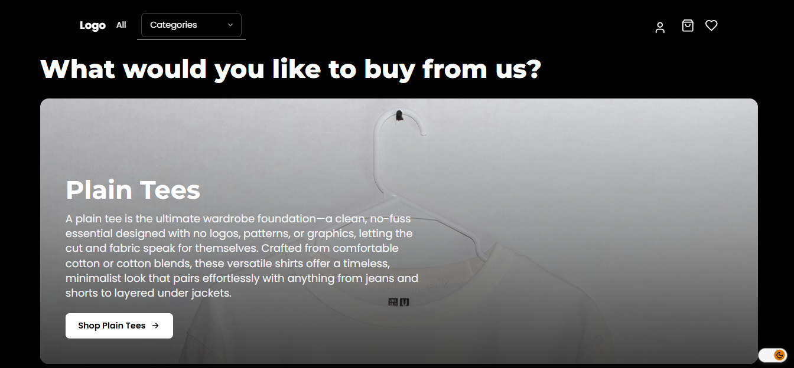
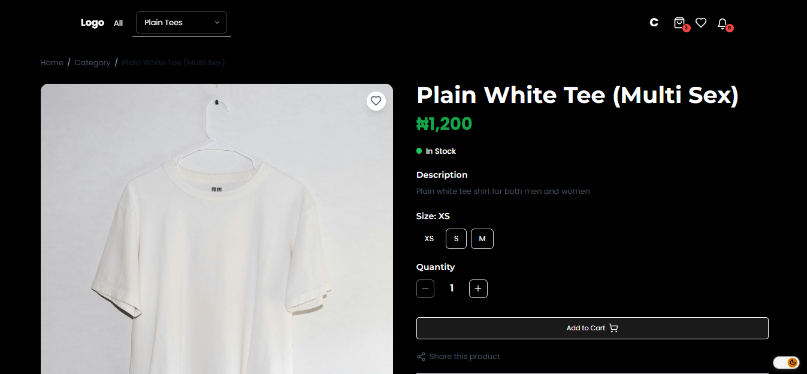
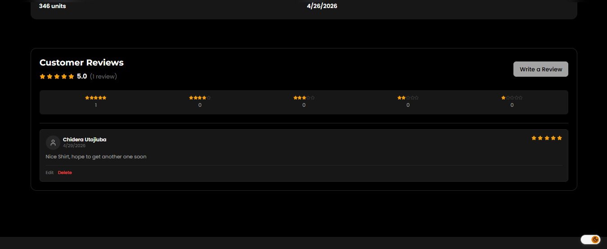
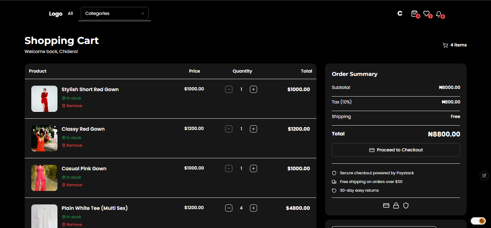
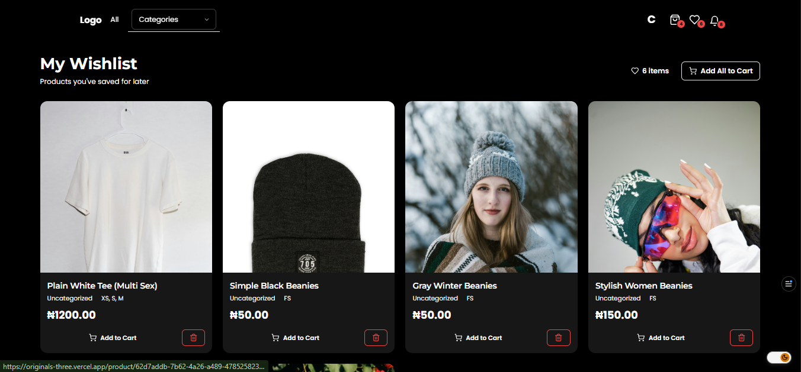
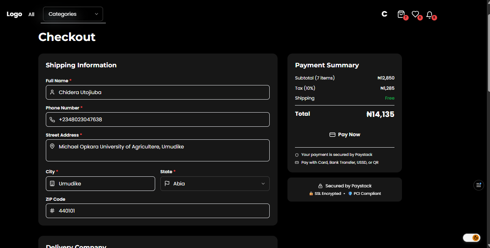
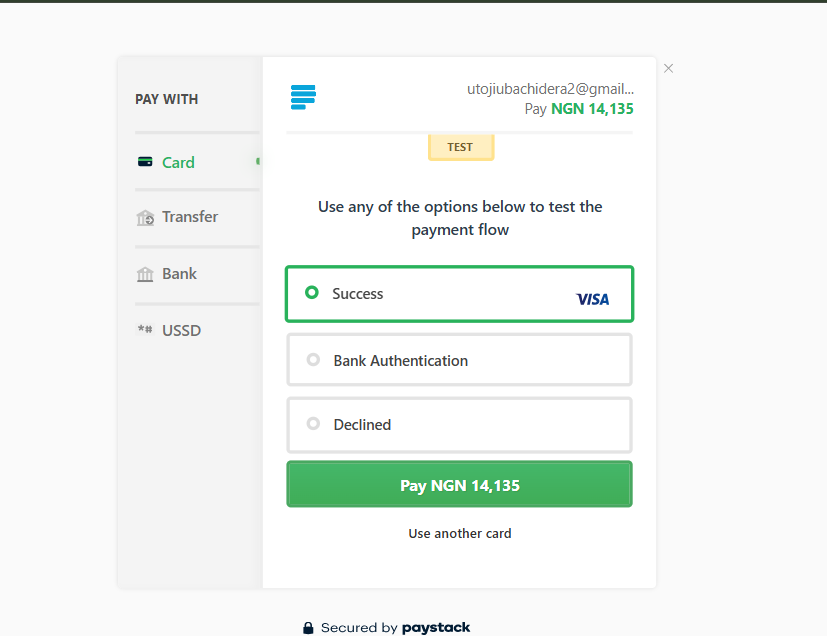
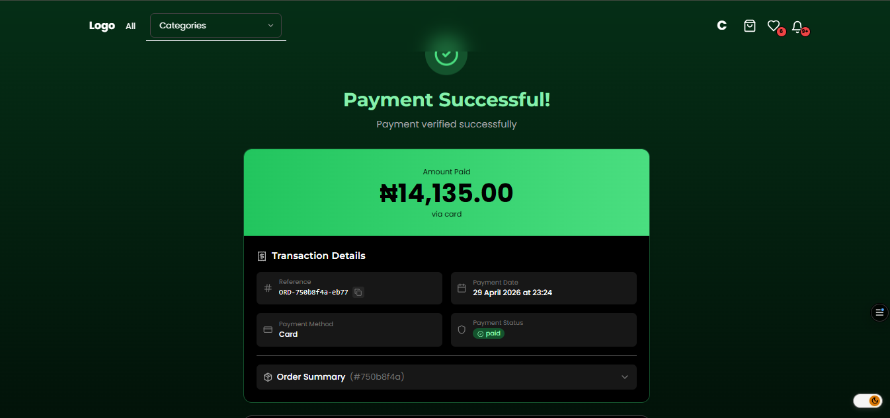
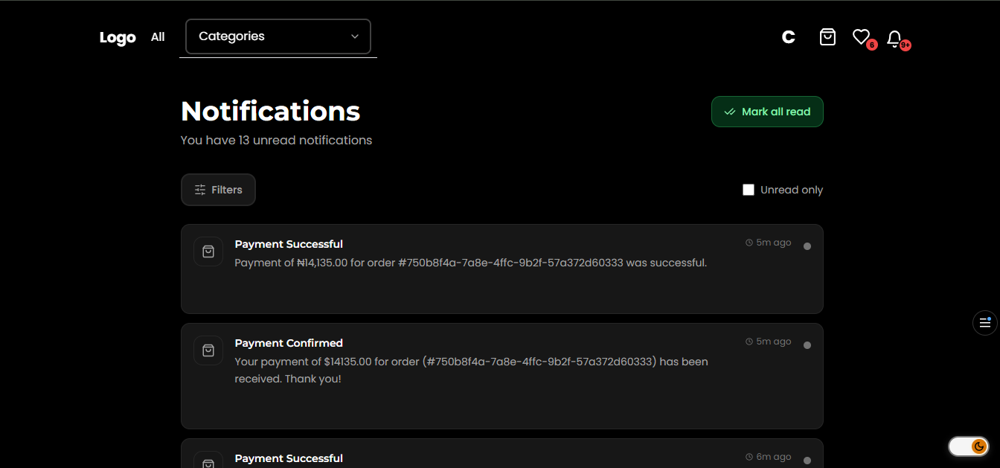
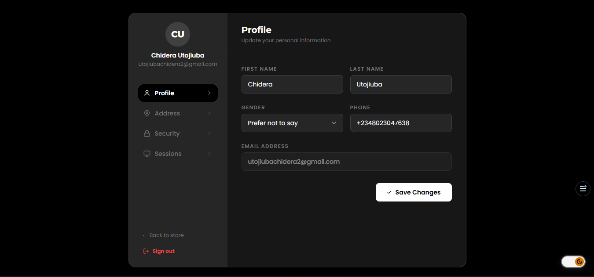

# AuthentiQ 🛍️

> A full-stack e-commerce platform for clothing, built as an internship project at **Maxfront Technologies Limited**.

**Developed by:** Utojiuba Chidera Gospel  
**Backend API Docs:** [https://sans-242869c0.fastapicloud.dev/docs](https://sans-242869c0.fastapicloud.dev/docs) _(view only)_  
**Live Frontend:** [https://originals-three.vercel.app/](https://originals-three.vercel.app/)
**GitHub Repository:** [https://github.com/Prime-02/authentiq](https://github.com/Prime-02/authentiq).

---

## Table of Contents

- [Overview](#overview)
- [Tech Stack](#tech-stack)
- [Features](#features)
- [Database Models](#database-models)
- [UI Screenshots](#ui-screenshots)

---

## Overview

AuthentiQ is a clothing e-commerce web application that allows users to browse products, manage a cart and wishlist, place orders, and complete payments — all through a clean, responsive interface. The platform includes an admin-facing backend with full product and order management, and integrates **Paystack** for secure Nigerian payment processing.

---

## Tech Stack

| Layer                 | Technology       |
| --------------------- | ---------------- |
| Frontend              | Next.js (React)  |
| Backend               | FastAPI (Python) |
| Database              | PostgreSQL       |
| ORM                   | SQLAlchemy       |
| Payments              | Paystack         |
| Deployment (Frontend) | Vercel           |
| Deployment (Backend)  | FastAPI Cloud    |

---

## Features

### User Accounts

- Registration and login with session-based authentication
- Secure password hashing
- User profile management including shipping address, city, state, and contact details
- Session tracking with IP address and user agent logging

### Product Catalogue

- Browse clothing products by category
- Product detail pages with descriptions, pricing, stock levels, and size options (XS, S, M, L, XL)
- Product images and barcode support
- Customer reviews and star ratings (1–5)

### Cart & Wishlist

- Add/remove items from a persistent shopping cart
- Save products to a wishlist for later
- Quantity management per cart item

### Orders & Checkout

- Full checkout flow with shipping address and method selection
- Order status tracking: `pending → processing → shipped → delivered → cancelled`
- Delivery company assignment per order
- Order history per user

### Payments

- Paystack integration for secure online payments
- Support for card, bank transfer, USSD, and other channels
- Payment status tracking: `pending → paid → failed → refunded`
- Full transaction history with gateway responses

### Notifications

- In-app notifications for order updates, promotions, and system messages
- Read/unread status with timestamps

---

## Database Models

The backend is structured around the following core models:

**User** — stores profile info, location, authentication credentials, and links to all user activity (cart, wishlist, orders, reviews, sessions, notifications, payment transactions).

**UserSession** — tracks active login sessions per user including session tokens, refresh tokens, IP address, user agent, and expiry.

**Product & Category** — products belong to a category and carry details like price, stock quantity, sizes, image URL, and active status. Each product can have multiple barcodes and reviews.

**Cart & CartItem** — each user has one cart containing multiple items, each referencing a product and a quantity.

**Wishlist & WishlistItem** — each user has one wishlist containing saved products.

**Order & OrderItem** — orders capture a snapshot of purchased items (including product name and unit price at time of purchase), shipping details, pricing breakdown (subtotal, shipping cost, tax, total), and delivery company assignment.

**PaymentTransaction** — records every Paystack transaction attempt linked to an order, including the reference code, authorization URL, payment channel, and gateway response.

**DeliveryCompany** — stores delivery partner information including service area type (local, regional, nationwide, worldwide) and covered states.

**Notification** — in-app notifications tied to a user with a type, message, and read status.

---

## UI Screenshots

### Landing Page

### Product Catalogue

### Category View

### Product Reviews

### Shopping Cart

### Wishlist

### Checkout

### Paystack Payment

### Payment Success

### Notifications

### User Profile

---

_Built with ❤️ by Utojiuba Chidera Gospel — Internship Project, Maxfront Technologies Limited_
